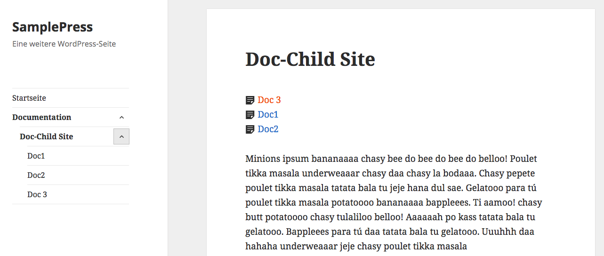

# Child Page Tree #

**Contributors:** obstschale  
**Donate link:** [PayPal Donation](http://bit.ly/hhb-paypal)  
**Tags:** page, tree, child, children  
**Requires at least:** 4.0  
**Stable tag:** 1.0.1  
**Tested up to:** 4.3  

Display a page tree of all child pages of the current site

## Description ##

_Child Page Tree_ is simple plugin which is born from a need. I needed a simple way to list all children pages of the current page. I use this plugin for [Dicentis Documentation](http://docs.dicentis.io) to list all documentation pages of a current site. In this scenario I use a hiearchy to reflect the categories a document belongs.

The plugin adds a select box to the page edit site right above the publish button. Using this select box you can decide whether to add and where to add the page tree. You can either add the page tree at the very top of page (prepend) or add it to the end of a page (append).

The output is a unorderd list with nested lists to reflect the hierarchy of the children. However this list can be changed using the build-in filter `child_page_tree_before_output`. This filter is applied before the list is added to content.

The plugin ships with basic stylesheet, which adds a icon to each link and does not show the hierarchy of the pages. The handler for this stylesheet ist `child_page_tree_style` and you can simple dequeue the script using `wp_dequeue_style()`. Another way to add your own custom style is to override the default style by using a custom CSS plugin. The page tree has an id (`ul#child_page_tree`) you can use and one class, either `.append` or `.prepend` depending its location.

### Requirements ###
* min. PHP 5.4

## Screenshots ##

### 1. Append page tree to site without any style ###

### 2. Prepend page tree with custom stylesheet ###

### 3. Example of usage for documentations ###

### 4. Select box in backend ###

## Installation ##

You can download and install the plugin using the built in WordPress plugin installer. If you download it manually, make sure it is uploaded to \"/wp-content/plugins/child-page-tree/\". Activate Child Page Tree in the \"Plugins\" admin panel using the \"Activate\" link.

## Frequently Asked Questions ##

### Can I add the page tree to another location on the page? ###

No. Currently the plugin only supports appending and prepending. A shortcode could work but is not planned.

### Is it possible to add a page tree of page X into page Y? ###

No. Child Page Tree displays only the page tree of the current site.

   
## Changelog ##

### 1.0.1 ###
* [FIX] setter call which caused PHP errors
* [FIX] load textdomain for translations
* [ADD] Banner and Icon for WordPress.org Repo
* [ADD] Check PHP version before instantiating object

### 1.0.0 ###
* Initial release of the plugin
* [FEATURE] append or prepend page tree to site
* [HOOK::FILTER] `child_page_tree_before_output` child page tree before adding it to content